   
   

 

   
   

   📫 How to reach me: <a href='mailto:beck.in.sale21061986@gmail.com'>beck.in.sale21061986@gmail.com</a>

 

## 🛠 Technical Stack

### **Frontend & Building**

&nbsp;&nbsp;&nbsp;&nbsp;&nbsp;&nbsp;&nbsp;&nbsp;&nbsp;&nbsp;&nbsp;&nbsp;&nbsp;&nbsp;&nbsp;&nbsp;&nbsp;&nbsp;&nbsp;&nbsp;&nbsp;&nbsp;

- **Libraries/Frameworks**: TS, React, Next.js, RTK/Zustand, TanStack Query
- **Bundlers**: Vite, Webpack
- **Architecture**: **FSD (Feature-Sliced Design)**, **Monorepo**

### **Backend & Databases**

&nbsp;&nbsp;&nbsp;&nbsp;&nbsp;&nbsp;&nbsp;&nbsp;&nbsp;&nbsp;&nbsp;&nbsp;&nbsp;&nbsp;&nbsp;&nbsp;&nbsp;&nbsp;

- **Core**: Node.js, Express, NestJS
- **Query/ORM**: Sequelize, Prisma 
- **Infrastructure**: PostgreSQL, Redis, Postman, Git

### **Testing & QA**
 

- **Unit Testing**: Jest
- **E2E Testing**: Playwright

### **AI & LLM Stack**
    

- **Tools**: Claude, OpenAI Codex, Gemini, Qwen
- **Expertise**: **RAG (Retrieval-Augmented Generation)**

 

## 💻 My opensource projects

*   [tuda.pro](https://github.com/trip-plan-AI/tuda) - High-performance web application designed to streamline the trip-organization process. It allows users to create detailed itineraries and visualize travel routes within a single, cohesive interface.
